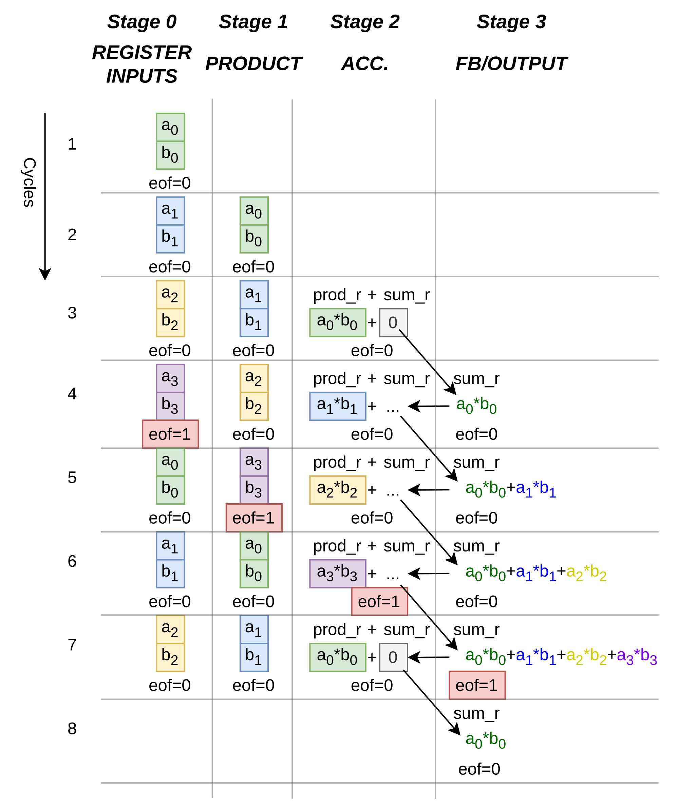
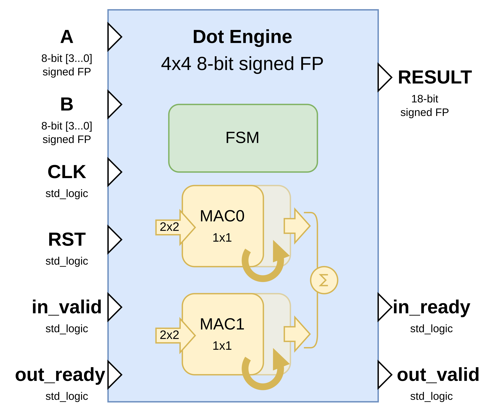
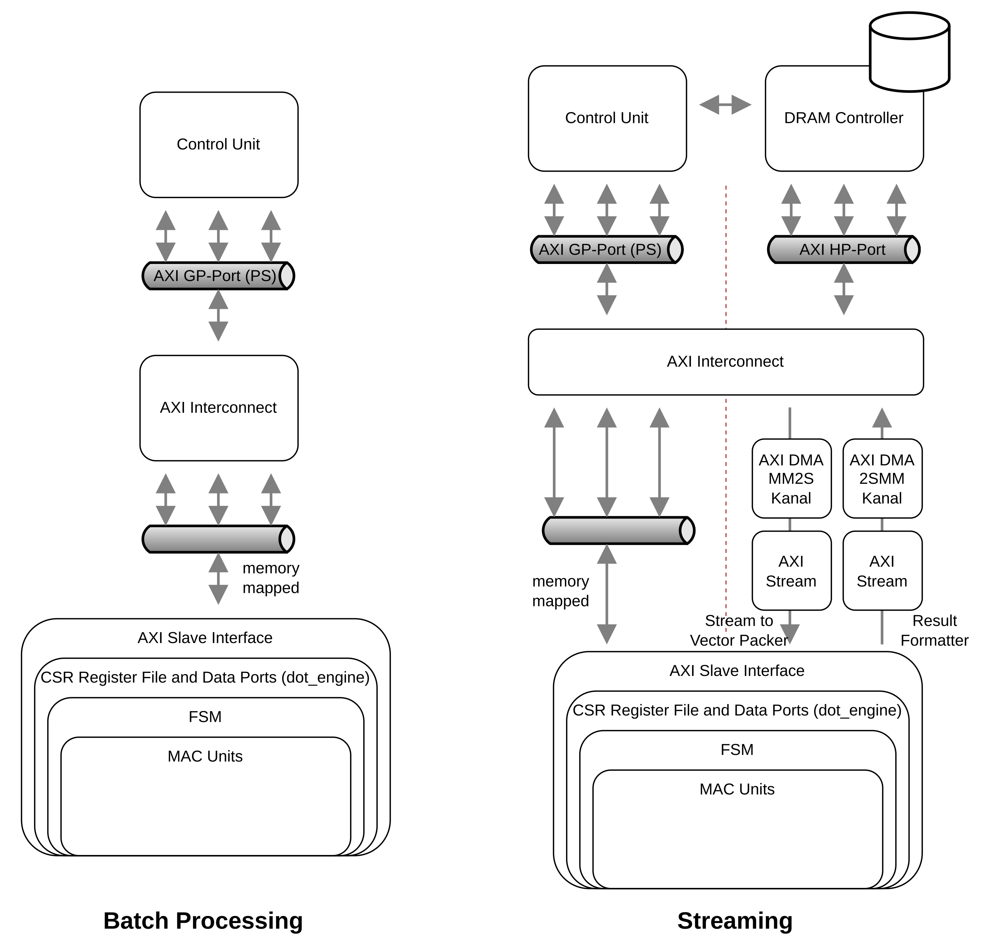

# Hardware Design -- The MAC Unit (Compute Core)

The design is written in VHDL (2008). Simulation was performed using GHDL 4.1.0. The project directory contains a build script that can be used to generate simulation results from the provided test bench.

- Top Level Module: `mac`
- Test bench: `tb_mac`

The MAC unit is based on a design that I originally developed for my Master Thesis[^1] in 2021 and was extended to meet the requirements of this task. In the current version, all inputs and outputs are registered, and an additional register stage was inserted after the multiplication operation.

- The MAC unit is implemented as a four-stage pipeline consisting of an input register stage, a multiplication stage, an accumulation stage, and a feedback/output stage.
- Control logic was added to make the MAC unit suitable for streaming operation.
- `enable` signal allows the entire pipeline to be stalled.
- `valid_in` signal ensures that only intended input samples contribute to the accumulated result.
- `valid_out` signal can be used by the top level module to align and time result availability.
- `eof` signal marks the end of an accumulation frame and allows consecutive frames to pass through the MAC unit without inserting idle cycles.

## Pipeline Stages

The pipeline stages were chosen to minimize the amount of combinational logic between registers. The multiplication stage likely represents the longest combinational path. In theory, it could be further split into additional pipeline stages, but this would provide little benefit. On modern hardware platforms, the multiplication and accumulation logic would typically be mapped to dedicated DSP resources anyway.

- **Stage 0: Register Inputs**  
  In this stage, inputs are registered. This stage is optional. A pair of input values out of a vector can be supplied. Control signals are registered too.

- **Stage 1: Product**  
  Computation of the product of the input pair. Control values are forwarded.

- **Stage 2: Accumulation**  
  The product is resized in order to meet the bit width of the result. Then, the product and a previous result (or `0`) are added together. Control signals are forwarded again. Except for `valid`, because this signal is not needed after this stage.

- **Stage 3: Feedback and Output**  
  In this stage, the result is presented to the output of the unit. The result is also fed back to the previous stage for accumulation of multiple results. If the `end-of-frame` signal has reached this stage, then the multiplexer will not route the result back to the previous stage.

## Performance

- Input: 2 input values per cycle
- Output: 0.25 output values per cycle (result ready on every 4th cycle)

# System Integration -- Memory Mapped Interface

## General

- Top Level Module: `dot_engine`
- Test bench: `tb_dot_engine`
- Instantiates the `mac` module twice
- Two MAC units operate in parallel
- Each MAC unit processes half of the vector elements using two sequential multiplications

Conceptually, the dot product could have been implemented using four parallel multiplications inside a single MAC unit followed by an adder tree. While this would be straightforward, it is not particularly interesting for demonstration purposes and scales poorly if the vector length changes in the future.

Instead, a single MAC unit performs one multiplication per cycle and is able to accumulate an arbitrary number of products. In principle, all four products could have been accumulated sequentially in a single MAC unit, but this would unnecessarily increase latency. For this reason, two MAC units operate in parallel. Each MAC unit processes half of the vector elements using two sequential multiplications. The final dot product sum is computed in the top level module.

  

## Register Map

All registers are 32 bits wide and word-aligned. Base denotes a base address of the IP block in the system memory map. Offsets are specified in bytes.

- **0x00 DOT_CTRL (W) -- Control Register** Drives the streaming handshake inputs of `dot_engine`. A transfer occurs *only* when `valid` and `ready` are high in the same cycle; otherwise it is only an announcement (valid) or willingness (ready).

  - **Bit 0: IN_VALID** When set to 1, `in_valid` is asserted towards `dot_engine`; when 0, `in_valid` is deasserted. IN_VALID indicates that the input data on ports `a` and `b` is valid and may be accepted. In the provided `dot_engine` FSM, new inputs are accepted only in state `S_IDLE`, where `in_ready = '1'`.

  - **Bit 1: OUT_READY** When set to 1, `out_ready` is asserted towards `dot_engine`; when 0, `out_ready` is deasserted. OUT_READY indicates that the consumer is ready to accept the result.

  - **Bit 2: RESET** When set to 1, `reset` is asserted towards `dot_engine` (active-high, synchronous to `clk`); when 0, `reset` is deasserted. On reset, the engine returns to the idle state and clears internal registers:
    - `state_r <- S_IDLE` (therefore `in_ready = '1'`)
    - `out_valid <- 0` and `result/sum <- 0`
    - all internal input/result registers in `dot_engine` are cleared to 0
    - in each `mac`, the accumulator `sum_r` and pipeline valids are cleared; the internal frame-start flag is initialized such that the first valid sample starts a fresh accumulation frame

- **0x04 DOT_STATUS (R) -- Status Register** Reflects the streaming handshake outputs of `dot_engine`.
  - **Bit 0: IN_READY** Mirrors `dot_engine` `in_ready`. IN_READY is driven by the consumer of the input (the `dot_engine`) and indicates that the engine is ready to accept a new batch.
  - **Bit 1: OUT_VALID** Mirrors `dot_engine` `out_valid`. OUT_VALID is driven by the producer of the result (the `dot_engine`) and indicates that `result` is valid and may be sampled. In the FSM, `out_valid` is asserted in state `S_SUM` and remains asserted (state `S_HOLD_OUT`) until `out_ready = '1'`, ensuring the result is not lost if the consumer stalls.

- **0x08 DOT_VEC_A (W) -- Packed Input Vector `a[0..3]`** Packed format: four signed 8-bit two's-complement values, little-endian:
  - **Bits 7:0** -- `a0`
  - **Bits 15:8** -- `a1`
  - **Bits 23:16** -- `a2`
  - **Bits 31:24** -- `a3`

- **0x0C DOT_VEC_B (W) -- Packed Input Vector `b[0..3]`** Packed format analogous to DOT_VEC_A: four signed 8-bit two's-complement values, little-endian:
  - **Bits 7:0** -- `b0`
  - **Bits 15:8** -- `b1`
  - **Bits 23:16** -- `b2`
  - **Bits 31:24** -- `b3`

- **0x10 RESULT (R) -- Dot Product Result** Provides the signed `dot_engine` result sign-extended to 32 bits:
  - **Bits 17:0** -- `result` from `dot_engine` (configured as `OUT_WIDTH = 18`)
  - **Bits 31:18** -- sign extension of bit 17

## Finite State Machine Description

The dot engine is controlled by a synchronous finite state machine that implements a batch oriented dot product computation using a ready/valid handshake at the input and output.

## Timing

From the moment the input vectors are presented and the `in_valid` signal is asserted, it takes seven clock cycles until a registered result is available at the output of the `dot_engine`. It would be possible to reduce the latency. For example, the inputs to the MAC units do not strictly need to be registered, and the final addition in the top level module could be implemented as purely combinational logic. These choices were made in favor of clarity and robust timing.

## Streaming Ready

The design was structured with streaming operation in mind. In pure batch mode, clock cycles are wasted and the overhead becomes significant. The `dot_engine` could be connected to a DMA unit and an MM2S converter and, on a Zynq 7000 SoC, directly stream data from and back to DDR memory via a high performance port. This would allow autonomous operation with minimal CPU involvement, limited to configuration and control.

For this reason, the `dot_engine` provides the `in_ready` output and the `out_ready` input signals, which follow common streaming interface conventions such as those used in AXI based systems. However, additional components are still missing. In particular, input and output FIFO buffers and backpressure control logic are not yet implemented.

## Scalability and Parameterization

All modules use generics to configure data widths and vector length. The vector length generic is currently prepared but not actively used, since changing the vector length has a strong impact on the architecture of the `dot_engine`. Full scalability could be achieved by using generate statements and additional helper functions to adapt the control logic and datapath automatically.

## System Integration

On the left of the system-level data flow diagram, the batch processing approach is shown, which corresponds to the currently implemented design. The CPU accesses the `dot_engine` through a memory-mapped AXI slave interface via the AXI GP port (on a Zynq 7000 SoC for instance). Input vectors are written into control and data registers, the computation is triggered via a handshake mechanism, and the result is read back by the CPU.

On the right, a streaming-based integration is depicted as a hypothetical extension. In this concept, data would be transferred between memory and the accelerator using AXI DMA engines and AXI-Stream interfaces, allowing the `dot_engine` to operate on continuous data streams with minimal CPU involvement.

[^1]: http://www.michael-hirschmugl.com/open-hw-cnn-zynq-wrap/
